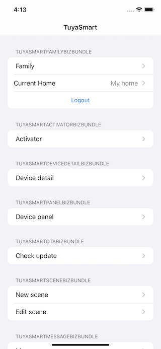

# Tuya iOS Biz Bundle Sample for Objective-c

This sample demonstrates the use of Tuya iOS Biz Bundle SDK to build an IoT App from scratch. It divides into several function groups to give developers a clear insight into the implementation for different features, includes the, home management for different users, device network configuration, and controls. For device network configuration, EZ mode and AP mode are implemented, which let developers pair devices over Wi-Fi, as well as control them via LAN and MQTT. For device control, it supplies a common panel for sending and receiving any kind types of data points.



## Requirements
* Xcode 12.0 and later
* iOS 12 and later


## Using this Sample
1. The Tuya Biz Bundle SDK is distributed through [CocoaPods](http://cocoapods.org/), as well as other dependencies in this sample. Please make sure you have CocoaPods installed, if not, install it first:

```bash
sudo gem install cocoapods
pod setup
```

2. Clone or download this sample, change the directory to the one with **Podfile** in it, then run the following command:

```bash
pod install
```

3. This sample requires you to have a pair of keys and a secure image from [Tuya IoT Platform](https://developer.tuya.com/), register a developer account if you don't have one, then follow the following steps:
    1. In the IoT platform, under the `App` side panel, choose `SDK Development`.
    2. Creating an App by clicking `Create` button.
    3. Fill in the required information. Please make sure you type in the correct Bundle ID, it cannot be changed afterward.
    4. You can find the AppKey, AppSecret, and security image under the `Obtain Key` tag.

4. Open the `tuya-bizbundle-ios-sample-objc.xcworkspace` that pod generated for you.
5. Fill in the AppKey and AppSecret in `AppKey.h` file.

```objective-c
#define APP_KEY @"<#AppKey#>"
#define APP_SECRET_KEY @"<#SecretKey#>"
```
6. Fill in the AppId and AppSecret in `ty_custom_config.json` file.

```objective-c
"appId": <#AppId#>,
"tyAppKey": "<#AppKey#>",
```

7. Download the security image and rename it to `t_s.bmp`, then drag it into the workspace to be at the same level as `Info.plist`.

**Note:** The bundle ID, AppKey, AppSecret, and security image must be the same as your App in Tuya IoT Platform; otherwise, the sample cannot successfully request the API.

## Self-developed Smart Life App Service
Self-Developed Smart Life App is one of Tuya’s IoT app development solutions. This solution provides the services that enable connections between the app and the cloud. It also supports a full range of services and capabilities that customers can use to independently develop mobile apps. The Smart Life App SDK used in this sample is included in the Self-developed Smart Life App Service.

Self-Developed Smart Life App is classified into the **Trial** and **Official** editions:

- **Self-Developed App Trial**: provided for a free trial. It supports up to 100,000 cloud API calls per month and up to 20 registered end users in total.

- **Self-Developed App Official**: provided for commercial use and costs $5,000/year (¥33,500/year) for the initial subscription and $2,000/year (¥13,500/year) for subsequent annual renewal. It is supplied with the Custom Domain Name service and up to 100 million cloud API calls per month.

For more information, please check the [Pricing](https://developer.tuya.com/en/docs/app-development/app-sdk-price?id=Kbu0tcr2cbx3o).

