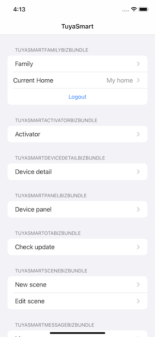

# 涂鸦 iOS UI业务包 Objective-c Sample 

此示例演示如何使用涂鸦iOSUI业务包SDK从头构建IoT应用程序。它分为几个功能组，使开发人员能够清楚地了解不同功能的实现，包括家庭管理、设备配网和设备控制等。对于设备网络配置，实现了EZ模式和AP模式，开发者可以通过Wi-Fi对设备进行配对，也可以通过LAN和MQTT对设备进行控制。对于设备控制，它提供了一个公共面板，用于发送和接收任何类型的数据点。



## 要求
* Xcode 12.0及以上
* iOS 12及以上


## 如何使用
1.涂鸦UI业务包SDK通过[CocoaPods]发布(http://cocoapods.org/)，以及此示例中的其他依赖项。请确保您已安装CoCoapod，如果没有，请先安装：

```bash
sudo gem install cocoapods
pod setup
```

2. 下载此示例，进入包含**Podfile**的目录，然后运行以下命令：

```bash
pod install
```

3. 此示例要求您拥有一对密钥和来自[TuyaIoT平台]的安全映像(https://developer.tuya.com/)，如果没有开发人员帐户，请注册开发人员帐户，然后执行以下步骤：
    1. 在IoT平台的“应用”侧面板下，选择“SDK开发”。
    2. 通过单击“创建”按钮创建应用程序。
    3. 填写所需信息。请确保键入正确的包ID，以后无法更改。
    4. 您可以在“获取密钥”标记下找到AppKey、AppSecret和安全图片。

4. 打开 pod为你生成的 `tuya-bizbundle-ios-sample-objc.xcworkspace` 。
5. 在 `AppKey.h` 文件中填写AppKey和AppSecret。

```objective-c
#define APP_KEY @"<#AppKey#>"
#define APP_SECRET_KEY @"<#SecretKey#>"
```
6. 在 `ty_custom_config.json` 中填写AppId和AppSecret。

```objective-c
"appId": <#AppId#>,
"tyAppKey": "<#AppKey#>",
```

7. 下载安全图片并将其重命名为 `t_s.bmp`, 然后将其拖到工作区中，使其与`Info.plist`同级。

**Note:** bundle ID、AppKey、AppSecret和安全图片必须与您在涂鸦物联网平台上的应用相同，否则示例无法成功请求API。


## 收费标准

SDK 是涂鸦 IoT App 解决方案的一种，以 App 云端连接服务为主，涉及收费标准详见[产品定价](https://developer.tuya.com/cn/docs/app-development/app-sdk-price?id=Kbu0tcr2cbx3o)
